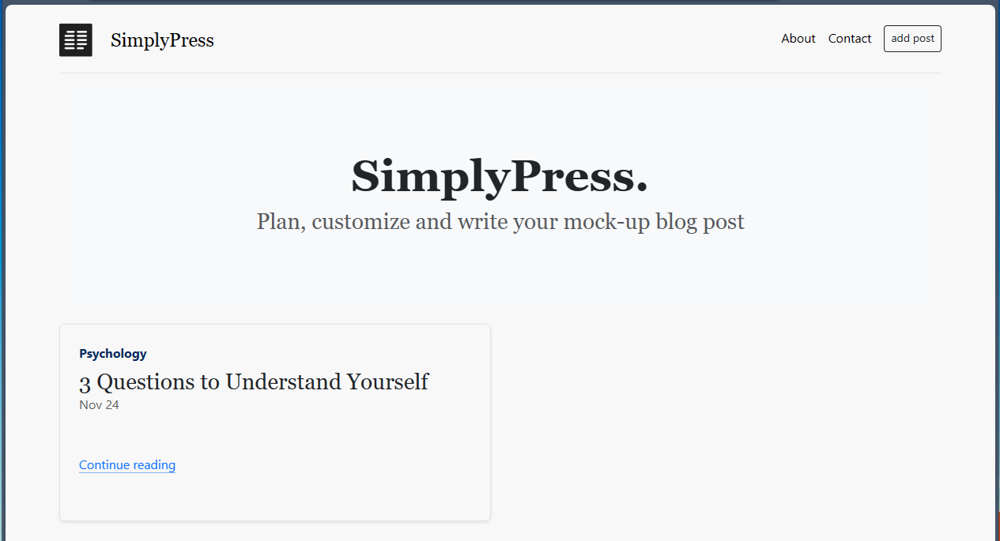

<h1 align="center">
   :newspaper: SimplyPress 
</h1>

<h4 align="center">
    Node.js driven blog post powered by Embedded JS, Express.JS (backend) and Bootstrap (CSS Framework) that provides basic functionality of <b>add, edit, delete post</b> without any database.
</h4>

<!-- Improved compatibility of back to top link: See: https://github.com/brendantwz/simplypress-blogpost/pull/73 -->
<a name="readme-top"></a>
<!--
*** Thanks for checking out the Best-README-Template. If you have a suggestion
*** that would make this better, please fork the repo and create a pull request
*** or simply open an issue with the tag "enhancement".
*** Don't forget to give the project a star!
*** Thanks again! Now go create something AMAZING! :D
-->


<!-- PROJECT LOGO -->
<br />
<div align="center">
  <a href="https://github.com/brendantwz/simplypress-blogpost">
    <kbd></kbd>
  </a>

  <p align="center">
      <!-- PROJECT SHIELDS -->
<!--
*** I'm using markdown "reference style" links for readability.
*** Reference links are enclosed in brackets [ ] instead of parentheses ( ).
*** See the bottom of this document for the declaration of the reference variables
*** for contributors-url, forks-url, etc. This is an optional, concise syntax you may use.
*** https://www.markdownguide.org/basic-syntax/#reference-style-links
-->

[![Contributors][contributors-shield]][contributors-url]
[![Forks][forks-shield]][forks-url]
[![Stargazers][stars-shield]][stars-url]
[![Issues][issues-shield]][issues-url]
[![MIT License][license-shield]][license-url]
[![LinkedIn][linkedin-shield]][linkedin-url]
    <br />
    <br />
    <a href="https://github.com/brendantwz/simplypress-blogpost/issues">Report Bug</a>
    ·
    <a href="https://github.com/brendantwz/simplypress-blogpost/issues">Request Feature</a>
      
  </p>
</div>

<!-- ABOUT THE PROJECT -->
## About The Project :brain:

<h3>Why this project?</h3>
Honestly, it is a random thought project that came across to me when I was browsing through "Medium Blogpost". <br>
It occured to me that, <b>"Do blogpost writer usually write down a mock up before they publish the finalized version? :thinking:"</b> and the rest is history. <br>
<br>
Eventually, this project as a testing ground for me since, I freshly learnt about Node.js and Express.js. 

<h3>What did I learn?</h3>
This project may not be exceptional but I encounter troubles and thought process going through this project. Here are the few key pointers
<br>
<br>

<b>Key takeaways lessons I picked up from this project:</b>
* Google or ChatGPT is your friend :left_speech_bubble: - knowing how to <b>prompt</b> a question will be super helpful in resolving your trouble
* Use framework or libraries :books: - coding natively is cool but it is not time-efficient. Be efficient.
* Always be asking "why" and have breakpoints  - nothing appear out of thin air. Segmenting your codes cleanly allow you to debug effectively. (will save you so much time and headaches! :warning:)
* Do not dwell on a problem too long :bed: - know when to call it stop. Take a short break if you need to. Staring at a problem while having a brain fog will not automatically solve it
* Breakdown big task into smaller ones :pinching_hand: - it is overwhelming to just take on big task. Always start with 1 feature at a time. You will see better delivery and progress in the project without overwhelming yourself

Of course, there are more but these are the few key ones that I felt will resonate with me and hopefully you throughout your development endeavour!<br>
<br>
If you find this helpful and would love to contribute or work with it. Feel free to drop a star!

<p align="right">(<a href="#readme-top">back to top</a>)</p>


### Built With :hammer_and_wrench:
* Embedded Javascript - simple templating language that allow HTML markup with plain javascript (its like HTML + JS combined, good for dynamic content)
* <a href="https://expressjs.com/">Express.js</a> - backend framework for node.js
* <a href="https://nodejs.org/en">Node.js</a> - Javascript runtime environment
* <a href="https://getbootstrap.com/">Bootstrap</a> - CSS framework that is has a set of responsive front-end template
* <a href="https://ionic.io/ionicons">ionicons</a> -  icon libraries

<p align="right">(<a href="#readme-top">back to top</a>)</p>


<!-- GETTING STARTED -->
## Getting Started :new:

If you want to play around with this project locally.
To get a local copy up and running follow these simple example steps.

### Prerequisites :eyes:

* Make sure you have Node.js installed on your local system

### Installation :computer:

1. Clone the repo
   ```sh
   git clone https://github.com/brendantwz/simplypress-blogpost
   ```
2. Install NPM packages
   ```sh
   npm install
   ```
3. Execute on your local system 
   ```sh
   node index.js
   ```
4. Open up on your desired browser
   ```sh
   localhost:3000
   ```

<p align="right">(<a href="#readme-top">back to top</a>)</p>


<!-- USAGE EXAMPLES -->
## Usage :space_invader:

<h3>1. Adding Post Feature</h3>

<div align="center">


</div>

<h3>2. Edit and Delete Feature</h3>

<div align="center">


</div>

<p align="right">(<a href="#readme-top">back to top</a>)</p>


<!-- CONTRIBUTING -->
## Contributing :gift:

Contributions are what make the open source community such an amazing place to learn, inspire, and create. Any contributions you make are **greatly appreciated**.

If you have a suggestion that would make this better, please fork the repo and create a pull request. You can also simply open an issue with the tag "enhancement".
Don't forget to give the project a star! Thanks again!

1. Fork the Project
2. Create your Feature Branch (`git checkout -b feature/AmazingFeature`)
3. Commit your Changes (`git commit -m 'Add some AmazingFeature'`)
4. Push to the Branch (`git push origin feature/AmazingFeature`)
5. Open a Pull Request

<p align="right">(<a href="#readme-top">back to top</a>)</p>


<!-- LICENSE -->
## License :clipboard:

Distributed under the MIT License. See `LICENSE.txt` for more information.

<p align="right">(<a href="#readme-top">back to top</a>)</p>


<!-- CONTACT -->
## Contact :iphone:

My LinkedIn - [@brendantwz](https://linkedin.com/in/brendantwz)

Project Link: [https://github.com/brendantwz/simplypress-blogpost](https://github.com/brendantwz/simplypress-blogpost)

<p align="right">(<a href="#readme-top">back to top</a>)</p>


<!-- ACKNOWLEDGMENTS -->
## Acknowledgments :muscle:

Use this space to list resources you find helpful and would like to give credit to. I've included a few of my favorites to kick things off!

* [MIT License](https://choosealicense.com/licenses/mit/)
* [Emoji Mart by missive](https://github-emoji-picker.rickstaa.dev/)
* [Img Shields](https://shields.io)
* [GitHub Pages](https://pages.github.com)
* [Font Awesome](https://fontawesome.com)
* [Ionicons](https://ionic.io/ionicons)
* [Readme Template](https://github.com/twanmulder/github-readme-templates)

<p align="right">(<a href="#readme-top">back to top</a>)</p>


<!-- MARKDOWN LINKS & IMAGES -->
<!-- https://www.markdownguide.org/basic-syntax/#reference-style-links -->
[contributors-shield]: https://img.shields.io/github/contributors/brendantwz/simplypress-blogpost.svg?style=for-the-badge
[contributors-url]: https://github.com/brendantwz/simplypress-blogpost/graphs/contributors
[forks-shield]: https://img.shields.io/github/forks/brendantwz/simplypress-blogpost.svg?style=for-the-badge
[forks-url]: https://github.com/brendantwz/simplypress-blogpost/network/members
[stars-shield]: https://img.shields.io/github/stars/brendantwz/simplypress-blogpost.svg?style=for-the-badge
[stars-url]: https://github.com/brendantwz/simplypress-blogpost/stargazers
[issues-shield]: https://img.shields.io/github/issues/brendantwz/simplypress-blogpost.svg?style=for-the-badge
[issues-url]: https://github.com/brendantwz/simplypress-blogpost/issues
[license-shield]: https://img.shields.io/github/license/brendantwz/simplypress-blogpost.svg?style=for-the-badge
[license-url]: https://github.com/brendantwz/simplypress-blogpost/blob/master/LICENSE.txt
[linkedin-shield]: https://img.shields.io/badge/-LinkedIn-black.svg?style=for-the-badge&logo=linkedin&colorB=555
[linkedin-url]: https://linkedin.com/in/brendantwz
